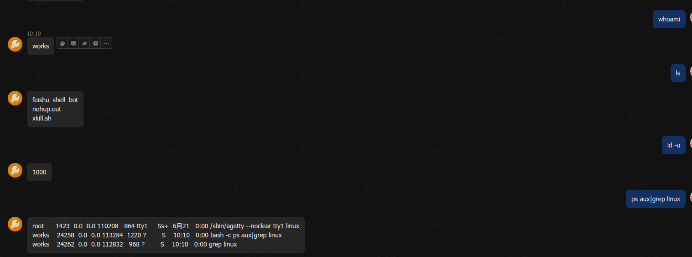
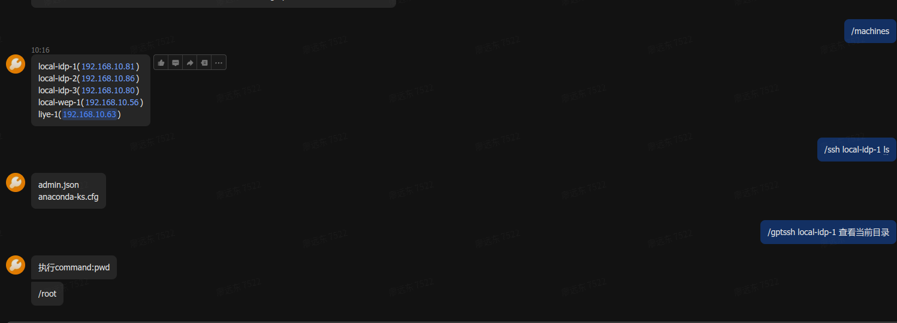

# Feishu-Shell-Bot
功能很简单。就是跑一个shell命令客户端。跟飞书ChatBot相关
基于飞书客户端

配置请配置.feishu.env.sample 然后重命名到 .feishu.env
或者也可以直接在环境变量中注入相应的配置

效果




```conf
FEISHU_APP_ID=飞书的AppId
FEISHU_APP_SECRET=飞书的AppSecret
FEISHU_ENCRYPT_KEY=飞书的EncryptKey
FEISHU_VERIFICATION_TOKEN=飞书的验证Token
FEISHU_BOT_PATH=监听服务的path
FEISHU_BOT_PORT=监听的端口
```

具体配置的含义请参考飞书后台开发者的文档.  
具体飞书怎么配置后端程序。请直接参考地址.  
[飞书开发者后台](https://www.feishu.cn/hc/zh-CN/articles/360049067916-%E5%A6%82%E4%BD%95%E5%BC%80%E5%8F%91%E4%BC%81%E4%B8%9A%E8%87%AA%E5%BB%BA%E5%BA%94%E7%94%A8)


## 直接使用(记得修改版本)
```shell
version=1.1
wget -O feishu_shell_bot https://github.com/friddle/lark-shell-bot/releases/download/${version}/feishu_shell_bot
chmod +x feishu_shell_bot
wget -O .feishu.env https://raw.githubusercontent.com/friddle/lark-shell-bot/master/.feishu.env.sample
编辑 .feishu.env
./feishu_shell_bot
```
或者使用
```docker
docker run -d -p 8080:8080 --env-file=.feishu.env friddle/lark-shell-bot
```


## 使用ChatGPT功能


设置ChatGpt
```shell
编辑.chatgpt.env 文件.所有的key参考.chatgpt.env.sample
填写相应的key

CHATGPT_API_KEY=aaaaaaaaaaaaaaaaaaaaaaaaaa
CHATGPT_API_TYPE=azure
CHATGPT_AZURE_RESOURCE=friddle
CHATGPT_AZURE_DEPLOYMENT=friddle-chatgpt-3.5
CHATGPT_AZURE_API_VERSION=2023-03-15-preview
```
然后飞书请求的时候执行
```shell
/chatgpt 查看本地目录
```

## 在服务器执行远程命令
设置服务器

```shell
编辑 .machines.env 文件
填写服务器信息
然后执行
/machines 查看服务器列表
/ssh machine-01 服务器名字 ls
/gptssh machine-01 服务器名字 查看当前目录
```


